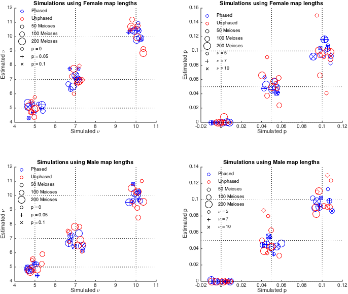

interference
============

MATLAB code for estimating crossover interference under the Housworth-Stahl model, following Campbell *et al*., 2014.

Requirements
------------

MATLAB 2014a or later, with Parallel Toolbox.

Usage
-----

The folder contains example functions to demonstrate simulation of crossover data given interference and escape paramters, followed by maximum likelihood estimation of those parameters.

+ **example_Stahl.m**      : Example of fitting the Housworth-Stahl model for simulated phase-known data.
+ **example_Stahl_quad.m** : Example of fitting the Housworth-Stahl model for simulated (phase-unknown) data.

The two scripts have similar usage syntax:

`[nu_est, p_est, lk_max, covariance_matrix] = example_Stahl(nu, p, cM_map_len, N_indv)`  
`[nu_est, p_est, lk_max, covariance_matrix] = example_Stahl_quad(nu, p, cM_map_len, N_indv)`

+ Output:
  - nu_est: estimated interference parameter.  
  - p_est: estimated escape parameter.  
  - lk_max: log likelihood of fitted model.  
  - covariance_matrix: covariance matrix estimated as inverse of fisher information matrix.  
  
+ Input:
  - nu: interference parameter to use for simulation (Required).  
  - p: escape parameter to use for simulation (Required).  
  - cM_map_len:	vector of chromosome map lengths in centiMorgans (optional. Default [200; 250]).  
  - N_indv: number of individuals to simulate (optional. Default 300).  
 
Other functions in the folder are used internally by the above scripts. Futher details can be found with the help comments at the start of each function. Brief descriptions follow:  

+ **simStahl.m**  : Simulate phase known data under the Housworth-Stahl model.
+ **simStahl_quad.m**  : Simulate phase unknown data (as derived from quartet families) under the Housworth-Stahl model.
+ **stahlLogLk.m** : Calculate the likelihood under the Housworth-Stahl model.
+ **stahlLogLk_quad.m** : Calculate the likelihood under the Housworth-Stahl model for phase-unknown data, as described in Campbell *et al*., 2014.
+ **derivest.m, fminsearchbnd.m, gradest.m, hessdiag.m, hessian.m** : All used internally, and derived directly from John D'Errico's contributions to the MATLAB file exchange, which can be found [here](http://www.mathworks.com/matlabcentral/fileexchange/8277-fminsearchbnd--fminsearchcon) and [here](http://www.mathworks.com/matlabcentral/fileexchange/13490-adaptive-robust-numerical-differentiation).

Performance
-----------

To test the performance of the estimator, we we have performed simulations of both phase-known and phase-unknown data. Specifically, we have simulated data assuming  interference parameter, nu = 5,7,10, and escape parameter, p = 0,0.05,0.1. For each combination of parameters, we simulated both phase known and phase unknown data representing 25, 50, and 100 meioses, and repeating the process for chromosome map lengths representative of both males and females. 

The above figure shows the performance of the phase-known and phase-unknown estimators on  the simulated data. For each figure, the phase-known estimates are shown in blue and the phase-unknown estimates are shown in red. The number of simulated meioses is indicated by the bubble size. Simulated values are indicated by black dotted lines, with random jitter having been added to the x-coordinate of each data point to aid visualization. 

In general, we see that while both estimators provide largely consistent estimates of the simulated parameters, the phase-unknown implementation requires a larger number of meioses to obtain accurate estimates. 